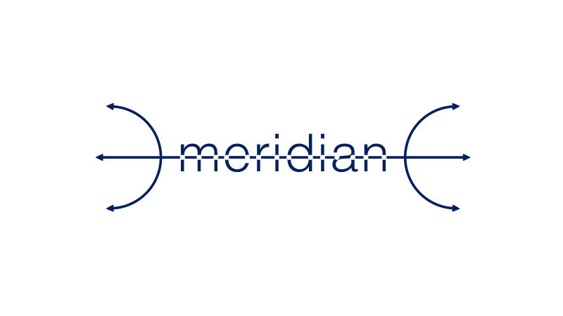
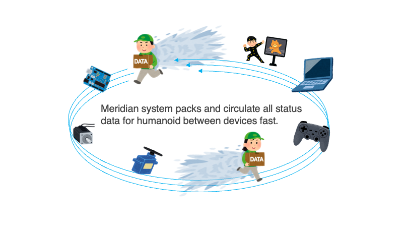
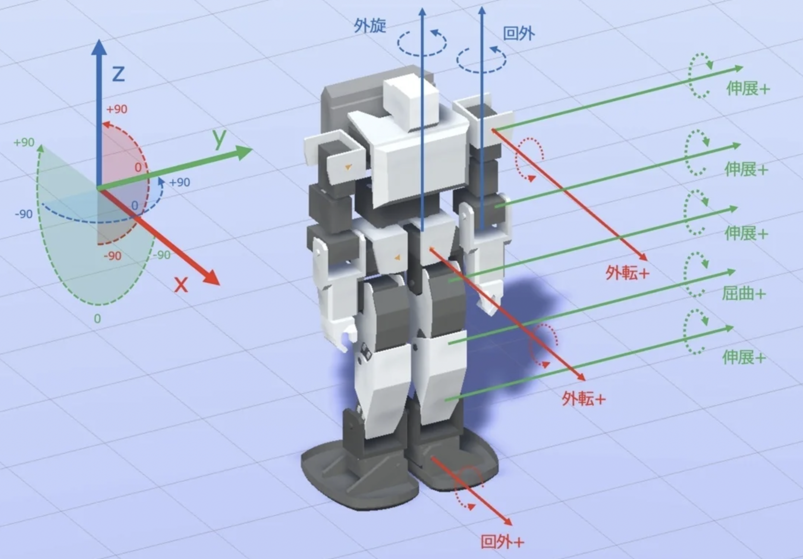
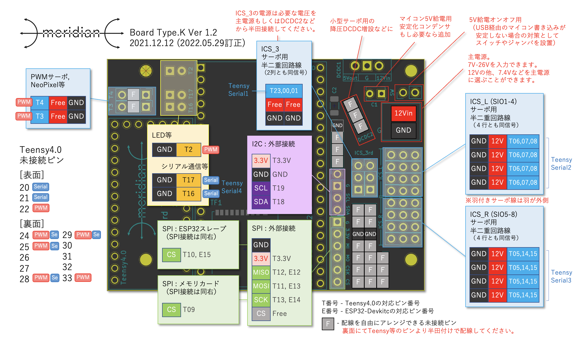
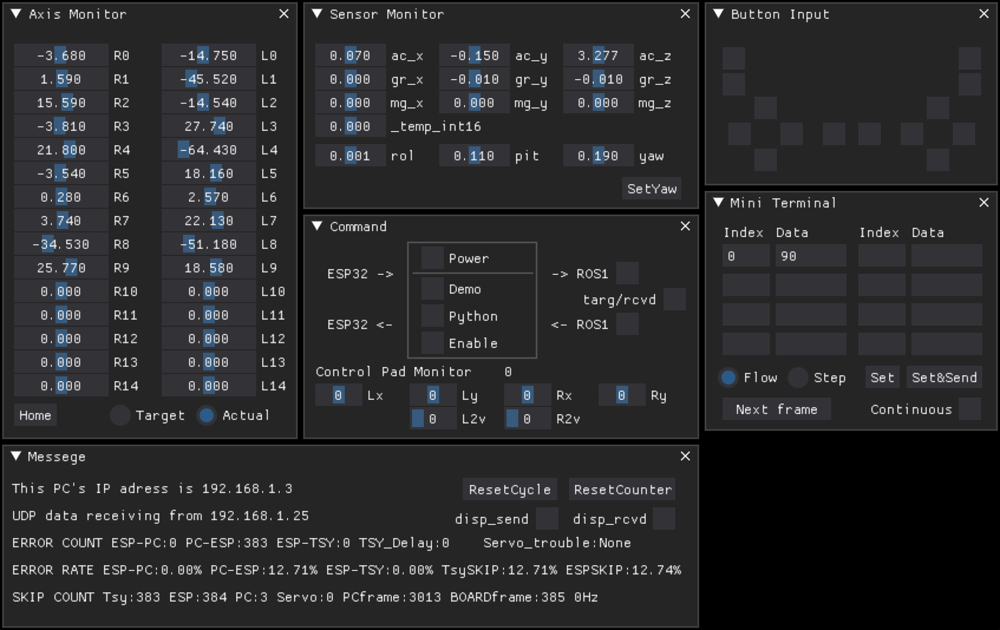
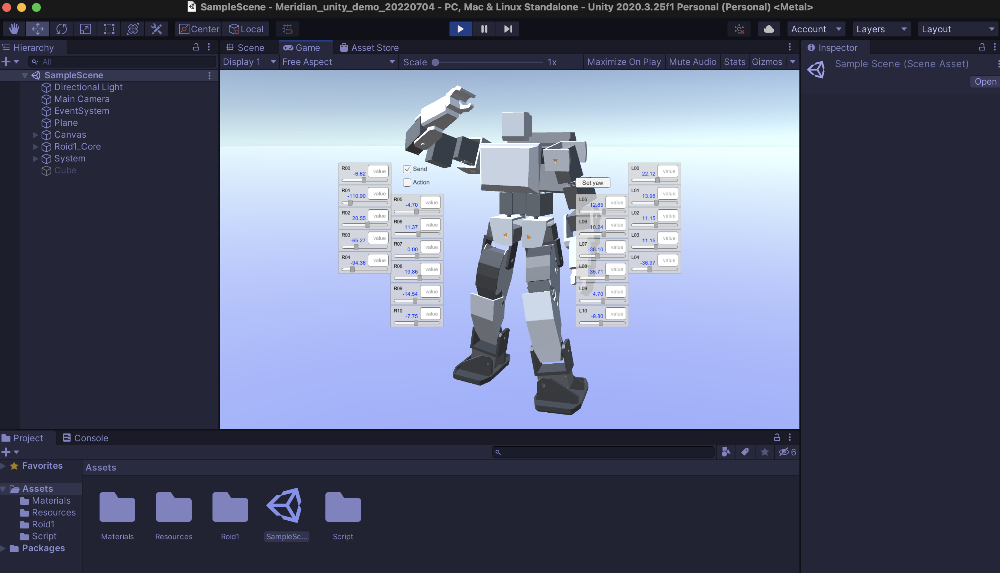

# [Meridian_TWIN v1.1.1](https://github.com/Ninagawa123/Meridian_TWIN)
  
  
    
Meridian計画はヒューマノイドの制御システムについてのオープンソースプロジェクトです.  
ホビーロボットのデジタルツイン化を簡単に実装することができ, PC上のシミュレーション空間とロボット実機をWIFI経由で10msの更新頻度でデータリンクします.  
  
システムの中核はMeridim配列というロボットの状態データを格納できる軽量で汎用的なデータ配列です.  
このデータ配列がデバイス間を高速に廻ることで, リアルタイムな状態データを共有を可能にします.  
Meridim配列を中間プロトコルとして既存のシステムの間に挟むことで, 複数社のコマンドサーボやセンサ, Unityなどの開発環境, ROSで使用可能な多岐にわたるシミュレーターなどを自由に繋ぎ合わせることができます.  
  
  
    
当リポジトリで取り扱う ”Meridian_TWIN" はESP32とTeensy4.0を併用するタイプで, 対応ボードはMeridian Board Type.Kとなります.  
また, ESP32DeckitC単体で動作する簡易バージョンのMeridian_LITE(対応ボードはMeridian Board -LITE-)も開発済みです.  
Meridianは今後も用途に応じて様々なハードウェア, ソフトウェアに対応させていく予定です.  
  
[](https://www.youtube.com/watch?v=4ymSV_Dot-U)  
100Hzデータリンクのデモ動画
  
[](https://www.youtube.com/watch?v=Wfc9j4Pmr3E)  
100Hzダンスのデモ動画
  
## 開発資料  
  
プログラムのフローや配列の定義, ボードのピンアサインについては「document」ディレクトリの中に資料としてまとめています.  
専用ボードの回路図も公開しており, 自作したりブレットボードで再現することが可能です.  
動作可能なサンプルプログラムも当リポジトリ内で公開しています.  
  
Meridianの概要や変数やライブラリ関数について, 下記に集約中です.（データが新しく, 説明のバージョンはv1.1.1となります.）  
[https://ninagawa123.github.io/Meridian_info/](https://ninagawa123.github.io/Meridian_info/)  
  
また, 全体の仕組みや開発進捗は以下のnoteにまとめています.  
[https://note.com/ninagawa123/n/ncfde7a6fc835](https://note.com/ninagawa123/n/ncfde7a6fc835)  
  
  
## System composition  
  
Meridian_TWINは, ハードウェアとして通信用のESP32DevKitC, 制御用のTeensy4.0, それらを連結する専用ボードのMeiridian Boardで構成されます.  
デモは近藤科学のKRSサーボ(通信速度1.25Mbps)に対応しており, Meiridian Board Type.KはKHR-3HV用に搭載することができます.  
PC側はROS1のmelodic/noeticに対応しており, 現在Rvizでの表示が可能です. またUnity(Mac/Win版)でもヒューマノイドの姿勢をリアルタイムに反映させることができます.  
  
  
  
  
## 開発環境  
- PlatformIO (Teensy4.0のプラットフォームバージョンは3.5.0対応)  
- Teensyduino(Teensy Loader 1.54, PlatformIOと併用)  
- Teensy4.0  
- ESP32DevkitC  
- MPU6050(GY-521)  
- Meridian Board Type.K  
  
  
## Installation  
Teensy4.0, ESP32DevKitCにそれぞれのファイルを書き込みます.  
以下の説明の理解にはPlatformIOやTeensy4.0, ESP32の扱いについてのごく初歩的な知識が必要です.
PlatformIOを初めて使うような方向けの導入手順については後日まとめる予定です.  
普段Arduino IDEを使っている方のためのPlatformIOの導入Tipsについては下記にまとめました.  
[https://qiita.com/Ninagawa_Izumi/items/6f58d9dbfdfe99be9c13](https://qiita.com/Ninagawa_Izumi/items/6f58d9dbfdfe99be9c13)  
    
  
## ファイルの準備  
当リポジトリ右上の「\<\>code」ボタンより「Download ZIP」を選択し,  
ファイルをお手元のPCの適切なディレクトリに展開します.  
(もちろんgit cloneなど他の手順でも構いません.)  

### Teensy4.0の準備  
#### PlatformIOでTeensy4.0用のプロジェクトファイルを開く  
PlatformIOのファイルメニューより「フォルダーを開く」とし, 先ほど展開したファイルの中から「Meridian_TWIN_for_Teensy40」のディレクトリを選択します.  
(Meridian_TWIN_for_ESP32と間違えないようご注意ください.)  

主なファイル構成は下記になります.  

```  
MERIDIAN_TWIN_Tsy40
 │  
 ├─ lib/
 │   ├ gs2d (汎用サーボライブラリ/順次対応)
 │   └ ICSClass_V210 (サーボ用ライブラリ)
 │  
 ├─ src/  
 │   ├ config.h      (設定ファイル)
 │   ├ main.h        (ヘッダファイル)
 │   ├ main.cpp      (Meridian本体)
 │   ├ mrd_disp.h    (以下各種コード)
 │   ├ mrd_eeprom.h  
 │   ├ mrd_hwtimer.h  
 │   ├ mrd_pad.h  
 │   ├ mrd_sd.h  
 │   ├ mrd_servo.h   
 │   ├ mrd_wire0.h  
 │   ├ mrd_wire1.h  
 │   ├ mrd_util.h   
 │   ├ mrd_move.h  
 │   │
 │   └ mrd_module/
 │         └ (各種モジュール)
 │
 ├─ .clang-format (コード自動整形設定ファイル)
 └─ platfomio.ini (ボード設定ファイル)  </p>
```

#### Teensy4.0に導入されるライブラリ
下記のライブラリはファイルを開く際に自動的に導入されます.  
- **Meridian by Ninagawa123** 
- **TsyDMASPI by hideakitai** 
- **MPU6050 by Electronic Cats** 
- **Adafruit_BNO055** 
- **Adafruit BusIO** 
- **Adafruit Unified Sensor** 
- **IcsClass_V210** (詳細は下記)

##### IcsClass_V210の導入について
近藤科学のICSサーボのためのライブラリもMITライセンスに基づき同梱していますが,  
最新版については下記をご参照ください.  
[https://kondo-robot.com/faq/ics-library-a2](https://kondo-robot.com/faq/ics-library-a2)  
  
#### サーボのマウントを設定する
Teensy4.0用のソースコードの「src/config.h」を開き,183行目ごろから始まるサーボ設定のところで,各サーボのマウントありなしを変更します.   
接続しているサーボIDに該当する箇所にサーボタイプの数値を入力します. KHR-3HV標準のKRSサーボの場合は43番です. サーボを接続していない箇所には0を設定します.  
サーボのマウント設定により, KHR-3HVのフルセットがなくてもICSサーボが最低１つあればデモをテストすることができます.  
  
#### ロボットの姿勢とサーボを設定する  
接続するKRSサーボの通信速度設定をすべて**1.25Mbps**に変更します.  
  
また, サーボの0度状態を下記の姿勢に, サーボの＋回転方向も下図の矢印方向に合わせます.  
左半身および体の中心は下図に順次つつ, 右半身については左半身のミラー方向に回転に合わせます.  
サーボの回転方向は, サーボの内部の設定変更が望ましいですが, 「src/config.h」でも変更できます.  
(ESP32用のファイルにも同名のconfig.hが存在しますのでご注意ください.)  

  
#### サーボを接続する
  
こちらのピンアサインを参考に, サーボを接続します.  
  
#### センサーを接続する  
MPU/AHRSセンサをMeridianボードのI2Cピンに接続します.  
今のところキャリブレーション済みのMPU6050(GY-521)のみ対応しています.  
センサーがない場合は, Teensy4.0のconfig.hでセンサの接続をオフにすることができます.(#define MOUNT_IMUAHRS NO_IMU)  
  
#### Teensy4.0にソースコードを書き込む
Teensy4.0とPCをUSBケーブルで接続し, PlatformIOの下にある「チェックマーク」のボタンを押して内容をビルドし,[SUCCESS]が表示されることを確認します. その後, 「→」ボタンを押してTeensy4.0にコードを書き込みます.(ボードは自動的に認識されます.)  
センサーやリモコンなどの機器の接続について, 「src/config.h」にて詳細を設定できます.    
  
### ESP32DevkitCの準備

#### PlatformIOでESP32用のプロジェクトファイルを開く  
PlatformIOのファイルメニューより「フォルダーを開く」とし, 先ほど展開したファイルの中から「Meridian_for_ESP32」のディレクトリを選択します.  
(Meridian_TWIN_for_Teensy40と間違えないよう注意.)  

主なファイル構成は下記になります.  

```  
MERIDIAN_TWIN_ESP32  
 ├─ lib/  
 │  └ ESP32Wiimote (wiiリモコン用ライブラリ)  
 │  
 ├─ src/  
 │   ├ config.h      (設定ファイル)
 │   ├ key.h         (wifi パスワード等)  
 │   ├ main.h        (ヘッダファイル)  
 │   ├ main.cpp      (Meridian本体)
 │   ├ mrd_bt_pad.h  (以下各種コード)  
 │   ├ mrd_disp.h   
 │   ├ mrd_eeprom.h
 │   ├ mrd_wifi.h
 │   └ mrd_util.h  
 │  
 ├─ .clang-format (コード自動整形設定ファイル)  
 └─ platfomio.ini (ボード設定ファイル)  
```

#### ESP32に導入されるライブラリ  
下記のライブラリはファイルを開く際に自動的に導入されます.  
- **Meridian@^0.1.0 by Ninagawa123**  
- **ESP32DMASPI@0.3.0 by hideakitai**  
  
PlatformIOで"MeridianTWIN_ESP32"等の名前で新規プロジェクトを作成し, BoardはEspressif ESP32 Dev Module, FrameWorkにはArduinoを選択します.  
  
##### 接続先のPCのIPアドレスを調べる
windowsのコマンドプロンプトを開き,  
$ ipconfig （Ubuntuの場合は$ ip a もしくは $ ifconfig）  
と入力しコマンド実行します.  
IPv4アドレスが表示されます(192.168.1.xxなど)  
Macの場合は画面右上のwifiマークから”ネットワーク”環境設定...で表示されます.  
  
##### WIFIを設定する  
「src/config.h」 // Wifiアクセスポイントの設定 のところで,  
接続したいWIFIのアクセスポイントのSSIDとパスワードを入力します.  
アクセスポイントは5GHzではなく**2.4GHz**に対応している必要があります.  
また, 先ほど調べた接続先のPCのIPアドレスも記入します.  
  
#### ESP32書き込み用のCP210ドライバを導入する  
すでにお手元でESP32 DevkitCに書き込みを行ったことのあるPCであれば問題ないですが, 
初めての場合, 「CP210x USB - UART ブリッジ VCP ドライバ」が必要になる場合があります. 
未導入の方は下記サイトより適切なものをインストールをしてください.  
[https://jp.silabs.com/developers/usb-to-uart-bridge-vcp-drivers?tab=downloads](https://jp.silabs.com/developers/usb-to-uart-bridge-vcp-drivers?tab=downloads
)
  
#### ESP32にソースコードを書き込む  
ここで一度, 更新したファイルを**セーブしESP32に書き込みます**.  
ESP32とPCをUSBケーブルで接続し, PlatformIOの下にある「チェックマーク」のボタンを押して内容をビルドし,[SUCCESS]が表示されることを確認します. その後, 「→」ボタンを押してESP32にコードを書き込みます.(ボードは自動的に認識されます.)  
  
##### ESP32のアップロードがうまくいかない場合  
アップロードが失敗する場合でも, 何度か行うことで成功する場合があるので試してみてください.  
アップロード開始時にESP32DeckitCのENボタンを押すことでアップロードがうまくいく場合もあります.  
また, ESP32DeckitCのENとGNDの間に10uFのセラミックコンデンサを入れると, ENボタンを押さずとも書き込みができるようになる場合があります.

#### ESP32のIPアドレスを調べる  
PlatformIOで画面下のコンセントアイコンからシリアルモニタを開き, ESP32DevKitC本体のENボタンを押します.  
wifi接続に成功すると  

> Hi, This is Meridian_TWIN_for_ESP32_vX.X.X_20XX.XX.XX  
> Set PC-USB 1000000 bps  
> Set SPI0   6000000 bps  
> WiFi connecting to => xxxxxxx  
> WiFi successfully connected.  
> PC's IP address target => 192.168.1.xxx  
> ESP32's IP address => 192.168.1.xxx  
>  
> -) Meridian TWIN system on side ESP32 now flows. (-  
  
と表示され, 「ESP32's IP address =>」にESP32本体のIPアドレスが表示されます.この番号をメモしておきます.  
  
#### platformio.ini  
platformio.iniでは以下の設定を行なっています.
- platformのバージョン指定
- ESP32内部システムからのエラーコードシリアル出力の抑制
- PCとのSerial通信速度設定を1,000,000に指定
- ライブラリの指定
- OTA（無線経由のプログラム書き込み機能）の無効化によるパーティション拡張
  
#### 設定の確認    
他にも, 接続するリモコンやシリアルモニタなどについての設定が可能です.  
Wiiリモコンを接続しない場合は必ず「src/config.h」内のMOUNT_PADをNONEに設定してください.  
  
#### 各種設定の確認  
Teensy4.0, ESP32両方の「src/config.h」内のコメントを参考に適宜変更してください.  
Teensy4.0は主にサーボやセンサーなどのハードウェア接続の設定や制御システムの基本設定,  
ESP32は主に通信系のWifiとBluetoothリモコンの設定になります.  
  
これでMeridian Board側の設定は完了です.  
  
  
## Meridian consoleを実行する  
Meridianで受け取るデータを表示できるコンソールを用意しました. python3が使える環境で実行可能です.  
https://github.com/Ninagawa123/Meridian_console  

  
## Unity版デモを実行する  
  
Meridian_TWINとUnityを連携させることができます.  
下記のリポジトリの内容をお試しください.  
[https://github.com/Ninagawa123/Meridian_Unity/tree/main](https://github.com/Ninagawa123/Meridian_Unity/tree/main)  
  


  
## ROS版デモを実行する
  
### ROS noeticの導入
お手持ちの環境にROSを導入してください.  
以下の公式のインストール方法をご参照ください.
http://wiki.ros.org/ja/noetic/Installation/Ubuntu
  
また, Raspberry pi4でROS-noeticを導入する手順については下記にまとめました.
https://qiita.com/Ninagawa_Izumi/items/e84e9841f7a048832fcc  
  
### URDFの表示テスト
https://github.com/Ninagawa123/roid1
まず, こちらのREADMEにしたがってRvizでロボットを表示できるか確認します.  
  

### ROS, rviz, meridian_demoを実行する
１つ目のターミナルを開き,  
$ roscore  
  
２つ目のターミナルを開き,  
$ roslaunch roid1_urdf display_meridian_demo.launch  
*この時点ではロボットはベースとなる腰部分しか表示されません*  
  
３つ目のターミナルを開き,  
$ CD ~/(Meridian_console.pyのあるディレクトリ)  
$ python Meridian_console.py  
  
MeridianBoardの電源を入れ接続が確立すると, Meridian consoleの画面のデータが小さく変動し続けます.  
ここでMeridian consoleの「->ROS1」にチェックを入れるとロボットRoid.1の姿が現れ,  ロボットのサーボ位置が画面の表示に反映されます.  
そのまま（他のチェックボックスが空の状態）で, ロボットのサーボを手で動かした時にロボットにも反映されます.  
  
また, 「DEMO」「Enable」にチェックを入れると, 画面内のロボットがサインカーブで構成されたダンスのデモを行います.  
ここでさらに「Power」にもチェックを入れると, ロボットのサーボにパワーが入り, 画面と同じ動きを実機で再現します.  
  
## おまけ：wiiリモコンへのESP32単体対応  
  
ESP32のBluetooth機能を使って, wiiリモコンおよびヌンチャクを動作させることができます.  
ただし, メインの通信に1~5%程度のエラーが発生します.  
ESP32のconfig.hで"#define MOUNT_PAD WIIMOTE"と設定してください.  
ボード起動時にwiiリモコンの1,2ボタン同時押しでペアリングできます.  
Homeボタンはヌンチャクのスティックレバーのキャリブレーションとなります.  
(ESP32の23番ピンをLEDアノード用の出力にしてあり, ペアリング中は点滅, ペアリング確立で点灯します.)  
  
## トラブルシューティング
  
### ROS版デモ実行時のトラブルシューティング
Error: Cannot assign requested address となる  
*→ おそらくアドレス番号が「192.168.x.xx」などのまま書き変わっていません.「ESP32のIPアドレスを調べる」「PCやラズパイ自身のIPアドレスを調べる」の項目を参考に,  
Meridian consoleのアドレスを更新してください.*  
  
### ボードが動いていない時のトラブルシューティング  
動作テストとしてUSB給電のみで使っている場合に動作しない場合があります.  
その場合, ESP32側にUSB給電することで動く場合があります.  
それでも動かない場合は電源供給付きのUSBハブを利用するか, Meridianボードに電源を接続することでアンペアを確保してください.  
Meridianボードの電源入力にバッテリーや安定化電源で電力を供給することでも安定的に動きます.  
  
### 既知の課題  

####  Meridian Board Type.K のフリーピン結線時の注意    
Meridian Board Type.Kには未接続のピン穴を複数設けてあり, 背面からマイコンの入出力と半田付けするすることでIOポートとして利用可能です.その際の注意点を以下にメモします.  
- ESP32のRX0, TX0はPCとのUSBシリアルで使用されています.  
- ESP32のGPIO6-11は内部フラッシュとの接続されておりIOとしては使用できないようです.  
- SPIの機器追加がうまくいかない場合は, 機器側の信号線をプルアップすることで動作が安定することがあります.  
  
####  ICSサーボの取得値のゆれ  
近藤科学のICS通信では, 取得するデータが常時小刻みに揺れています.
このためUnityやRviz,Meridian Consoleで表示した際にも, ピクピクと揺れます.  
(表示側である程度の揺れを吸収する場合もあります.)  

####  Meridian Board でサーボのデータが途切れ途切れになる  
USBバスパワーのみで動作させている場合など, サーボへの電力供給が足りていない場合, サーボがリセットを繰り返すことにより返信データが途切れやすくなります. ボードに正しく電源を接続してください.  

####  Meridian Board でサーボが全く反応しない  
サーボ接続時にコネクタの方向を間違えることで, 半二重回路が破損します.  
万が一回路が破損した場合には,3系統の回路で代用するか, 修理用のキット(BOOTHで販売)で回路を交換してください.    

####  9軸センサのBNO055がうまく動作しない  
Teensy4.0との相性問題で,通信中に正しいデータが取得できなくなります.改善方法を探っています.  
  
####  ボードへの書き込み用ビルドが成功しない  
特にESP32のSPI関連でのビルド失敗が、古いファームウェアの場合に起こりえます。  
PlatformIOでのボードファームウェアをESP32は6.6.0、Teensyは5.0.0に設定することで動作することが確認できています。  


## Update情報  

#### Update 20240817 v1.1.1
命名規則を取り入れ, 変数名をアップデートしました.  
Wiiリモコンがつかえるおまけ機能を復活させました.  
  
#### Update 20240506 v1.1.0
コードの内容を大幅にリファクタリングし, アップデートしました.
コードを機能ごとのファイルに分け, モージュール化しました. これにより追加機能の開発に取り組みやすくなりました.  


  


また, 通信フローを抜本的に見直し, 送受信の上り, 下りを明確にしました. 具体的には, これまでTeensy-ESP間の通信は1フレームあたり1回でしtが, 通信を2回行うようにしました. これによりPC側からみて, 送信したコマンドの実行結果が入った受信データをリアルタムに受け取れるようになりました.  
    
  
#### Update 20240325 v1.0.1  
esp32側のpratformio.ini内, lib_depsのhideakitai/ESP32DMASPI@0.1.2が自動では検出できなくなったため,   
hideakitai/ESP32DMASPI@0.3.0 にアップデートしました.   
  
#### Update 20230710  v1.0.0
ライブラリ対応版として大幅なアップデートを行いました.(前回までのバージョンはoldディレクトリにzipで格納しています.)      
メインが整理され, 改造の見通しが立ちやすくなりました.  
  
<hr>  
  
## [Merimote v0.0.1](https://github.com/Ninagawa123/Merimote)  
  
  
  
Meridianと親和するリモコン受信機のコードも公開しました. M5StampPICOをWiiremoteやPS4コントローラーの受信機とし, I2C経由でMeridianにPADデータを流し込めます.  
  
[https://github.com/Ninagawa123/Merimote?tab=readme-ov-file](https://github.com/Ninagawa123/Merimote?tab=readme-ov-file
)
