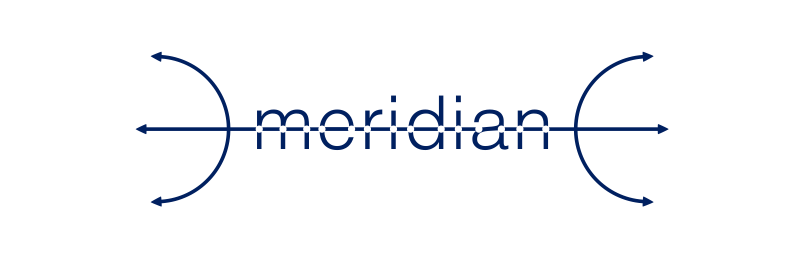
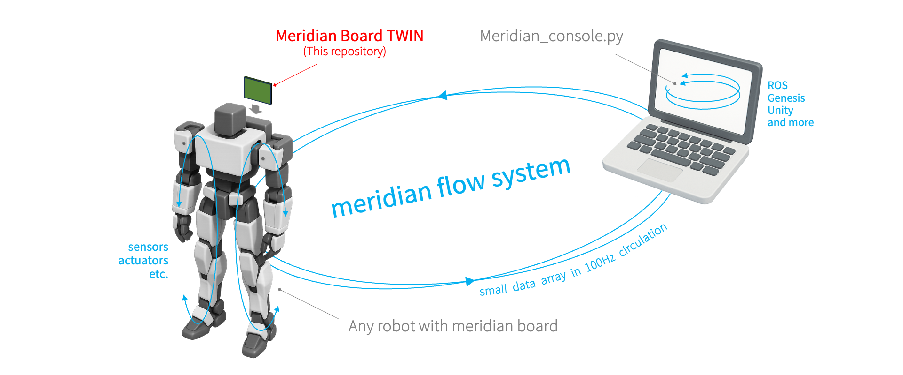

# Meridian_TWIN
  
  
    
Meridian_TWIN は, ロボットのリアルタイムなデジタルツイン化を実現する**Meridian**(meridian flow system)の一部です.    
センサーやサーボを制御しながら, PC等のデバイスとロボットの状態情報を 100 Hz の頻度で共有することができます.  
  
処理能力の高い Teensy4.0 と通信能力のある ESP32DevKitC を連携させて併用することで, 高い拡張性と安定性を実現します.  
  
  

システムの中核は[Meridim90](https://ninagawa123.github.io/Meridian_info/#Protocol/Meridim90/overview90/)というコンパクトで汎用的なデータ配列です.  
このデータ配列が中間プロトコルとしてデバイス間を高速に循環することで, リアルタイムな状態データの共有を実現します.  
Meridim90の介在により, メーカーの異なる複数のコマンドサーボやセンサ, UnityやROSなど既存のさまざまな開発環境やシミュレータが共存, 連携できるようになるのが大きな強みです. もちろん, PCをリモートブレインとしてロボット実機を動かすことも可能です.  
  
[](https://www.youtube.com/watch?v=4ymSV_Dot-U)  
  
Meridianはオープンソースプロジェクトとして2021年に開始し, 現在も有志の開発者により, 様々なハードウェア, ソフトウェアへの対応が進められています.  
    
<br><hr>  

# Getting started 1 (LITE版)  
  
ESP32DevKitC のみを使用した最小限の構成で動作確認が可能です.  
 [Meridian LITEのリンク](https://github.com/Ninagawa123/Meridian_LITE)よりお試しください.  

上記のMeridianの動作確認にあたり,  
- Arduinoを使った電子工作の経験 (LチカレベルでOK)  
- pythonのコードを実行した経験 (コーディングの知識は不要)  
  
など, ごく初歩的な前提知識が必要となります.  
また, PlatformIOの導入の基本についても, 上記で軽く説明しています.  
  
<br><hr>  
  
# Getting started 2 (TWIN版)  
  
当リポジトリで取り扱う Meridian_TWIN は ESP32DevKitC と Teensy4.0 を併用するタイプで, 対応ボードはMeridian Board Type.Kとなります.  
  
近藤科学の小型二足ロボットキット**KHR-3HV**へのMeridian Board搭載を例に, 導入方法を説明します.  

  
[](https://www.youtube.com/watch?v=Wfc9j4Pmr3E)  
100Hzダンスのデモ動画  
  

## 準備物
- [ESP32-DevKitC](https://www.espressif.com/en/products/devkits/esp32-devkitc/overview) ([Espressifの正規品](https://www.espressif.com/en/products/devkits/esp32-devkitc/overview)を使用してください)  
- Teensy4.0  
- Meridian Board Type.K もしくは自作ボード[回路図](https://github.com/Ninagawa123/Meridian_TWIN/blob/main/docs/Meridian_TypeK_schema.pdf)  
- Teensyduino(Teensy Loader 1.54, PlatformIOと併用)  
- PlatformIO (Teensy4.0 のプラットフォームバージョンは3.5.0対応)  
- WiFi付きPC (Windows, Mac, Ubuntu のいずれか)  
- WiFiアクセスポイント (2.4 GHz 通信対応)  
- USBケーブル (Teensy4.0 / ESP32DevKitC とPCを接続するためのもの)  
- [PlatformIO](https://platformio.org/) 開発およびボード書き込み用のアプリケーション  
- python環境  
- [KHR-3HV](https://kondo-robot.com/product-category/robot/khrseries)本体, もしくはKONDO ICSサーボ1個以上.  
- 電源(KHR付属バッテリー, 安定化電源等)
- SDカード (なくてもOK)  
- MPU6050(GY-521) (なくてもOK)  
- Unity (なくてもOK)  
- ROS1のmelodic/noetic (なくてもOK)
- KRR-5FHリモコン, もしくはWiiリモコン (なくてもOK)
  
### Meridian Board Type.K について  

  
  
"Meridian Board Type.K" はサーボ制御用の半二重通信回路3系統とSPI,I2Cなどの基本的な入出力ピンを備えたボードです. Teensy4.0 と ESP32DevKitC を搭載し, サーボやセンサーを接続して使用します.  
  
#### ボードの制作もしくは入手の方法  
- [回路図を公開](https://github.com/Ninagawa123/Meridian_TWIN/blob/main/docs/Meridian_TypeK_schema.pdf)しており, 自作することが可能です.  
- 完成品ボードの頒布もあります. [https://1985b.booth.pm/](https://1985b.booth.pm/)  
  
#### Board と ESP32DevKitCのドッキング  

Meridian Board Type.Kのメモリカードスロット側を下として, Teensy4.0, ESP32DevKitC それぞれのUSBポートが下になるように設置します.  
  
## Installation  
Teensy4.0, ESP32DevKitCにそれぞれのファイルを書き込みます.  
以下の説明の理解には PlatformIO や Teensy4.0, ESP32の扱いについてのごく初歩的な知識が必要です.
(普段Arduino IDEを使っている方のためのPlatformIOの導入Tipsを[こちら(リンク)](https://qiita.com/Ninagawa_Izumi/items/6f58d9dbfdfe99be9c13)にまとめました.)  
  
### ファイルの準備  
当リポジトリ右上の「\<\>code」ボタンより「Download ZIP」を選択し, ファイルをお手元のPCの適切なディレクトリに展開します.  
(もちろんgit cloneなど他の手順でも構いません.)  
  
### Teensy4.0の準備  
「Meridian_TWIN_Tsy40」ディレクトリの中にあるワークスペースファイル「Meridian_TWIN_for_Tsy40.code-workspace」をVScodeなどで開きます.  

### Teensy4.0に導入されるライブラリ
下記のライブラリはファイルを開く際に自動的に導入されます.  
- **Meridian by Ninagawa123** 
- **TsyDMASPI by hideakitai** 
- **MPU6050 by Electronic Cats** 
- **Adafruit_BNO055** 
- **Adafruit BusIO** 
- **Adafruit Unified Sensor** 
- **IcsClass_V210** (詳細は下記)

#### IcsClass_V210の導入について
近藤科学のICSサーボのためのライブラリもMITライセンスに基づき同梱していますが,  
最新版については下記をご参照ください.  
[https://kondo-robot.com/faq/ics-library-a2](https://kondo-robot.com/faq/ics-library-a2)  
  
#### サーボのマウントを設定する
Teensy4.0用のソースコードの「src/config.h」を開き,160行目ごろから始まるサーボ設定のところで,各サーボのマウントありなしを設定します.  
接続しているサーボIDに該当する箇所にサーボタイプの数値を入力します. KHR-3HV標準のKRSサーボの場合は43番です. サーボを接続していない箇所には0を設定します.  
(サーボのマウント設定により, KHR-3HVのフルセットがなくてもICSサーボが最低1つあればデモをテストすることができます.)  
  
#### ロボットの姿勢とサーボを設定する  
接続するKRSサーボの通信速度設定をすべて** 1.25 Mbps**に変更します.  
  
また, サーボの0度状態を下記の姿勢に, サーボの＋回転方向も下図の矢印方向に合わせます.  
左半身および体の中心は下図に準じつつ, 右半身については左半身のミラー方向に回転に合わせます.  
サーボの回転方向は, サーボの内部の設定変更が望ましいですが, 「src/config.h」でも変更できます.  
(ESP32用のファイルにも同名のconfig.hが存在しますのでご注意ください.)  
サーボ初期位置の微調整(トリム調整)の方法については後述します.  

  
#### サーボを接続する
  
こちらのピンアサインを参考に, サーボを接続します.  
  
#### センサーを接続する  
MPU/AHRSセンサをMeridianボードのI2Cピンに接続します.  
今のところキャリブレーション済みのMPU6050(GY-521)のみ対応しています.  
センサーがない場合は, Teensy4.0 のconfig.hでセンサの接続をオフにすることができます.(#define MOUNT_IMUAHRS NO_IMU)  
  
#### ビルドの確認とTeensy4.0へのアップロード(書き込み)
Teensy4.0 とPCをUSBケーブルで接続し, PlatformIOの下にある"チェックマーク"のボタンを押して内容をビルドし,[SUCCESS]が表示されることを確認します.  
その後, 「→」ボタンを押して Teensy4.0 にコードを書き込みます.(ボードは自動的に認識されます.)  
センサーやリモコンなどの機器の接続について, 「src/config.h」にて詳細を設定できます.  
  
### ESP32DevKitCの準備  
「Meridian_TWIN_ESP32」ディレクトリの中にあるワークスペースファイル「Meridian_TWIN_for_ESP32.code-workspace」をVScodeなどで開きます.  
  
#### ESP32に導入されるライブラリ  
下記のライブラリはファイルを開く際に自動的に導入されます.  
- **Meridian@^0.1.0 by Ninagawa123**  
- **ESP32DMASPI@0.3.0 by hideakitai**  
  
#### keys.hの修正  
  
```
#define AP_SSID "xxxxxx"             // アクセスポイントのAP_SSID  
#define AP_PASS "xxxxxx"             // アクセスポイントのパスワード  
#define SEND_IP "192.168.1.xx"       // 送り先のPCのIPアドレス(PCのIPアドレスを調べておく)  
```
  
の部分について, 接続するWiFiの**2.4 GHz のアクセスポイントのSSID**と**パスワード**を設定します.  
(※ESP32-DevKitCは5Ghzには対応してません)  
また, **通信相手となるPCのIPアドレス** も設定します.  
<details>
<summary>PCのIPアドレスの調べ方</summary>
Windows : ターミナルを開いてipconfigコマンド<br>
ubuntu : ターミナルでip aコマンド<br>
mac : 画面右上のwifiアイコンから"ネットワーク"環境設定...<br>
で確認できます.  
</details>
  
#### ESP32書き込み用のCP210ドライバを導入する  
すでにお手元で ESP32DevKitC に書き込みを行ったことのあるPCであれば問題ないですが, 
初めての場合, 「CP210x USB - UART ブリッジ VCP ドライバ」が必要になる場合があります. 
未導入の方は下記サイトより適切なものをインストールをしてください.  
[https://www.silabs.com/developer-tools/usb-to-uart-bridge-vcp-drivers](https://www.silabs.com/developer-tools/usb-to-uart-bridge-vcp-drivers)
  
#### ビルドの確認とESP32-DevKitCへのアップロード(書き込み)  
ここで一度, 更新済みのファイルを**セーブし, ESP32に書き込みます**.  
ESP32とPCをUSBケーブルで接続し, PlatformIOの下にある「チェックマーク」のボタンを押して内容をビルドし,[SUCCESS]が表示されることを確認します. その後, 「→」ボタンを押してESP32にコードを書き込みます.(ボードは自動的に認識されます.)  
  
##### ESP32のアップロードがうまくいかない場合  
アップロードが失敗する場合でも, 何度か行うことで成功する場合があるので試してみてください.  
アップロード開始時に ESP32DevKitC のENボタンを押すことでアップロードがうまくいく場合もあります.  
また, ESP32DevKitC のENとGNDの間に10uFのセラミックコンデンサを入れると, ENボタンを押さずとも書き込みができるようになる場合があります.

#### ESP32のIPアドレスを調べる  
PlatformIOで画面下のコンセントアイコンからシリアルモニタを開き, ESP32DevKitC 本体のENボタンを押します.  
wifi接続に成功すると  

> Hi, This is Meridian_TWIN_for_ESP32_vX.X.X_20XX.XX.XX  
> Set PC-USB 1000000 bps  
> Set SPI0   6000000 bps  
> ...
> WiFi connecting to => xxxxxxx  
> WiFi successfully connected.  
> PC's IP address target => 192.168.1.xxx  
> ESP32's IP address => 192.168.1.xxx  
>  
> -) Meridian TWIN system on side ESP32 now flows. (-  
  
と表示され, 「ESP32's IP address =>」にESP32本体のIPアドレスが表示されます.この番号をメモしておきます.  
  
##### platformio.ini  
  
platformio.iniでは主に以下の設定を行なっています.
- platformのバージョン指定
- ESP32内部システムからのエラーコードシリアル出力の抑制
- PCとのSerial通信速度設定を1,000,000に指定
- ライブラリの指定
- OTA(無線経由のプログラム書き込み機能)の無効化によるパーティション拡張
  
#### 各種設定の確認  
他にも, 接続するリモコンやシリアルモニタなどについての設定が可能です.  
Teensy4.0, ESP32両方の「src/config.h」内のコメントを参考に適宜変更してください.  
Teensy4.0 は主にサーボやセンサーなどのハードウェア接続の設定や制御システムの基本設定,  
ESP32は主に通信系のWifiとBluetoothリモコンの設定になります.  
Wiiリモコンを接続しない場合は必ず「src/config.h」内のMOUNT_PADをNONEに設定してください.  
  
これでMeridian Board側の設定は完了です.  
  

## Meridian consoleを実行する  
### Meridian consoleの導入  
PC側のMeridian通信ソフトの一つである[Meridian console](https://github.com/Ninagawa123/Meridian_console)を起動します.    
ダウンロードや導入の方法については下記のURLに従ってください.  
https://github.com/Ninagawa123/Meridian_console  
  
さきほど書き留めた**ESP32's IP address**が必要となります.  
  
### Meridian consoleの起動  
Meridian consoleを起動し, ESP32DevKitC の電源が入っていると自動的に通信が始まります.  
通信が成功すると, Meridian consoleが動きはじめます.  
画面下部の **PCframe**と**BOARDframe**がカウントアップされ, **99~100Hz**の表記があれば通信成功です.  
  


## Unity版デモを実行する  
  
Meridian_TWINとUnityを連携させることができます.  
下記のリポジトリの内容をお試しください.  
[https://github.com/Ninagawa123/Meridian_Unity/tree/main](https://github.com/Ninagawa123/Meridian_Unity/tree/main)  
  


  
## ROS版デモを実行する
  
### ROS noeticの導入
お手持ちの環境にROSを導入してください.  
以下の公式のインストール方法をご参照ください.
http://wiki.ros.org/ja/noetic/Installation/Ubuntu
  
また, Raspberry pi4でROS-noeticを導入する手順については下記にまとめました.
https://qiita.com/Ninagawa_Izumi/items/e84e9841f7a048832fcc  
  
### URDFの表示テスト
https://github.com/Ninagawa123/roid1
まず, こちらのREADMEにしたがってRvizでロボットを表示できるか確認します.  
  
### ROS, rviz, meridian_demoを実行する
１つ目のターミナルを開き,  
$ roscore  
  
２つ目のターミナルを開き,  
$ roslaunch roid1_urdf display_meridian_demo.launch  
*この時点ではロボットはベースとなる腰部分しか表示されません*  
  
３つ目のターミナルを開き,  
$ cd ~/(Meridian_console.pyのあるディレクトリ)  
$ python Meridian_console.py  
  
MeridianBoardの電源を入れ接続が確立すると, Meridian consoleの画面のデータが小さく変動し続けます.  
ここでMeridian consoleの「->ROS1」にチェックを入れるとロボットRoid.1の姿が現れ,  ロボットのサーボ位置が画面の表示に反映されます.  
そのまま(他のチェックボックスが空の状態)で, ロボットのサーボを手で動かした時にロボットにも反映されます.  
  
また, 「DEMO」「Enable」にチェックを入れると, 画面内のロボットがサインカーブで構成されたダンスのデモを行います.  
ここでさらに「Power」にもチェックを入れると, ロボットのサーボにパワーが入り, 画面と同じ動きを実機で再現します.  
  
  
## リモコンの使用方法  
  
**KRR-5FH/KRC5-FH**  
config.hにて「#define MOUNT_PAD KRR5FH」と設定してボードにアップロードします.  
受信機のKRR-5FHはボードの**R系統に接続**します. KRC-5FHのペアリングは製品の説明書の通りです.  
受信信号はMeridianに格納されるので, Meridian_console.pyでボタンの受信状況が確認できます.  
  
**Wiiリモコン**  
Wiiリモコンはおまけ機能です. (Meridianの通信速度が若干低下します.)  
config.hにて「#define MOUNT_PAD WiiMOTE」と設定してボードにアップロードします.  
起動直後にWiiリモコンの1,2ボタンを両押しするとペアリングが確立します.ヌンチャクのレバーも左側のアナログ十字スティックとして機能します.  
また, HOMEボタンがアナログスティックのキャリブレーション(リセット)として機能します.  

  
## トラブルシューティング
  
### ROS版デモ実行時のトラブルシューティング
Error: Cannot assign requested address となる  
*→ おそらくアドレス番号が「192.168.x.xx」などのまま書き変わっていません.「ESP32のIPアドレスを調べる」「PCやラズパイ自身のIPアドレスを調べる」の項目を参考に,  
Meridian consoleのアドレスを更新してください.*  
  
### ボードが動いていない時のトラブルシューティング  
動作テストとしてUSB給電のみで使っている場合に動作しない場合があります.  
その場合, ESP32側にUSB給電することで動く場合があります.  
それでも動かない場合は電源供給付きのUSBハブを利用するか, Meridianボードに電源を接続することでアンペアを確保してください.  
Meridianボードの電源入力にバッテリーや安定化電源で電力を供給することでも安定的に動きます.  

### Teensyだけが動かない  
I2C等の接続デバイスの極性などが間違っている可能性があります.(結果的にTeensyの電源がGNDにショートしている可能性)  
  
### 既知の課題  

####  Meridian Board Type.K のフリーピン結線時の注意    
Meridian Board Type.Kには未接続のピン穴を複数設けてあり, 背面からマイコンの入出力と半田付けすることでIOポートとして利用可能です.その際の注意点を以下にメモします.  
- ESP32のRX0, TX0はPCとのUSBシリアルで使用されています.  
- ESP32のGPIO6-11は内部フラッシュとの接続されており IO としては使用できないようです.  
- SPIの機器追加がうまくいかない場合は, 機器側の信号線をプルアップすることで動作が安定することがあります.  
  
####  ICSサーボの取得値のゆれ  
近藤科学のICS通信では, 取得するデータが常時小刻みに揺れています.
このためUnityやRviz, Meridian Consoleで表示した際にも, ピクピクと揺れます.  
(表示側である程度の揺れを吸収する場合もあります.)  

####  Meridian Board でサーボのデータが途切れ途切れになる  
USBバスパワーのみで動作させている場合など, サーボへの電力供給が足りていない場合, サーボがリセットを繰り返すことにより返信データが途切れやすくなります. ボードに正しく電源を接続してください.  

####  Meridian Board でサーボが全く反応しない  
サーボ接続時にコネクタの方向を間違えることで, 半二重回路が破損します.  
万が一回路が破損した場合には, 3系統の回路で代用するか, 修理用のキット(BOOTHで販売)で回路を交換してください.    

####  9軸センサのBNO055がうまく動作しない  
Teensy4.0 との相性問題で, 通信中に正しいデータが取得できなくなります. 改善方法を探っています.  
  
####  ボードへの書き込み用ビルドが成功しない  
特にESP32のSPI関連でのビルド失敗が, 古いファームウェアの場合に起こりえます.  
PlatformIOでのボードファームウェアをESP32は6.6.0, Teensyは5.0.0に設定することで動作することが確認できています.  


## Update情報  

#### Update 20250505 v1.1.1
Meridian_console.pyの「トリム調整モード」に対応しました.  
  
#### Update 20240817 v1.1.1
命名規則を取り入れ, 変数名をアップデートしました.  
Wiiリモコンがつかえるおまけ機能を復活させました.  
  
#### Update 20240506 v1.1.0
コードの内容を大幅にリファクタリングし, アップデートしました.
コードを機能ごとのファイルに分け, モジュール化しました. これにより追加機能の開発に取り組みやすくなりました.  
  

  

  
また, 通信フローを抜本的に見直し, 送受信の上り, 下りを明確にしました. 具体的には, これまでTeensy-ESP間の通信は1フレームあたり1回でしたが, 通信を2回行うようにしました. これによりPC側からみて, 送信したコマンドの実行結果が入った受信データをリアルタイムに受け取れるようになりました.  
  
#### Update 20240325 v1.0.1  
esp32側のplatformio.ini内, lib_depsのhideakitai/ESP32DMASPI@0.1.2が自動では検出できなくなったため,   
hideakitai/ESP32DMASPI@0.3.0 にアップデートしました.   
  
#### Update 20230710  v1.0.0
ライブラリ対応版として大幅なアップデートを行いました.(前回までのバージョンはoldディレクトリにzipで格納しています.)      
メインが整理され, 改造の見通しが立ちやすくなりました.  
  
<hr>  
  
## 開発資料  
  
プログラムのフローや配列の定義, ボードのピンアサインについては「docs」ディレクトリの中に資料としてまとめています.  
専用ボードの回路図も公開しており, 自作したりブレットボードで再現することが可能です.  
動作可能なサンプルプログラムも当リポジトリ内で公開しています.  
  
Meridianの概要や変数やライブラリ関数について, 下記に集約中です.(説明のバージョンはv1.1.1となります.)  
[https://ninagawa123.github.io/Meridian_info/](https://ninagawa123.github.io/Meridian_info/)  
  
また, 全体の仕組みや開発進捗は以下のnoteにまとめています.  
[https://note.com/ninagawa123/n/ncfde7a6fc835](https://note.com/ninagawa123/n/ncfde7a6fc835)  
  
<hr>  
  
## [Merimote v0.0.1](https://github.com/Ninagawa123/Merimote)  
  
  
  
Meridianと親和するリモコン受信機のコードも公開中です.  
M5StampPICOをWiiremoteやPS4コントローラーの受信機とし, I2C経由でMeridianにPADデータを流し込めます.  
  
[https://github.com/Ninagawa123/Merimote?tab=readme-ov-file](https://github.com/Ninagawa123/Merimote?tab=readme-ov-file
)
